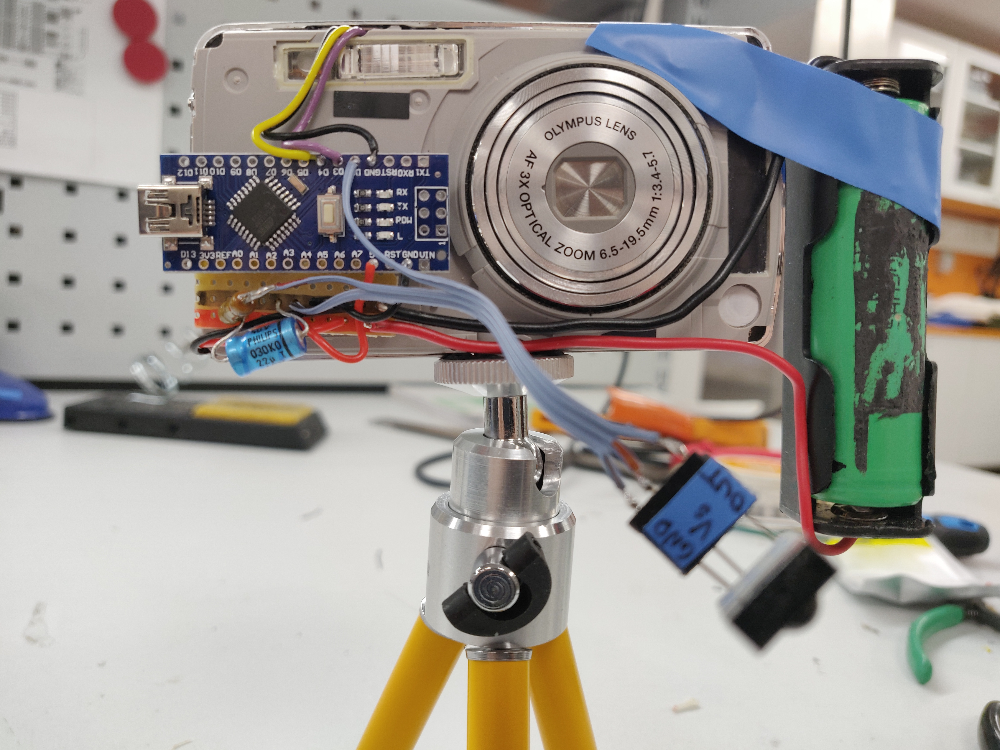

# Development notes

In this project a regular digital camera was turned into a remote controllable one using arduino and a basic infrared remote.

The main components in this project are:
* -the camera (I used an Olympus u760)
* -arduino nano
* -infrared receiver module TSOP1736
* -generic infrared remote from an audio pre-amplifier (MaiA Pre-amp)
* -lithium-ion cell 18650 3.7 V and a holder for it

You'll also need:
* -100 ohm resistor
* -10...22 uF capacitor
* -some wire
* -on-off switch
* -male and female pin headers
* -some small screws
* -prototyping board
* -basic tools for building and debugging electronics (oscilloscope, multimeter, soldering iron, variable power supply etc.)

# Workflow:

## Hardware
The first thing was to ensure all the main components are in working order. The camera's battery had died over the years and unfortunately could not be used anymore.
So to confirm that the camera works, wires needed to be connected to the battery contacts of the camera and voltage applied to them.

*Wires to battery contacts*

I used a workbench power supply to provide 4.0 volts to the camera and ensure proper function.

As a new power source was needed for the camera, I chose to use a simple 18650 lithium-ion cell I had heaps of laying around from other projects. The battery was charged full with a separate Li-Ion charger and was confirmed to hold charge well by measuring its voltage with a multimeter during the construction of the project.
The battery provides power not only for the camera, but for all the other components as well (excluding the remote).

Human eye can't sense the infrared light from the remote, but a digital camera can. So I just pointed it at my mobile phone's camera to confirm that the IR led indeed was lit.

The next thing was to establish a connection between arduino and the infrared transmitter. I started by wiring the TSOP1736 to the arduino.

*Testing the infrared sensor*

The sensor [datasheet](https://www.voti.nl/docs/TSOP17.pdf) includes a wiring example, which I replicated on my breadboard:
* -22 uF capacitor between 5 V and GND 
* -sensor Vs to 5 V via a 100 ohm resistor
* -GND to GND
* -sensor signal out pin to arduino digital pin 2

Before I started reading the sensor output with arduino, I confirmed that the sensor was outputting signal, which actually was very clear.

*Signal from CH+ button*

The remote control has five buttons, all of which were tested with the oscilloscope.

*Remote control used in this project*

The waveforms were saved and decoded with pencil and paper. The information turned out to be manchester-coded [https://en.wikipedia.org/wiki/Manchester_code], which is a common encoding protocol in infrared communication.

*CH- button signal decoded*

Next it was time to reverse-engineer the camera. For that, the camera needed to be partly disassembled.

*Camera disassembled*

The shutter button controls both the focus and the shutter.  The goal was to control shutter and focus remotely and by pulling pins in the image to ground with the arduino the desired effect was achieved.

*Shutter button contact pads*

I figured out the pinout with the continuity test on a multimeter and connecting the other probe to battery ground and the other one to each of the shutter pins. After finding the GND pin, I used a piece of wire to connect the other pins to the GND and found out the functionality: Connect FOCUS pin to GND and the camera will focus. Connect SHUTTER and FOCUS to GND and the camera will take a photo.

With all the functional parts gathered and working, I soldered all them together as shown in the image.

*All the functional components connected*

To help connect all the ground and voltage supply connections as well as the passive components together, I used a small piece of prototyping board. 

## Software
The software for the arduino was written in arduino IDE and utilizes the IRremote library available in the arduino library manager. For the source code, see [source](src/main_prog2/main_program.ino).
I got lucky and the remote controlled camera worked on the first try! Some small tweaks to the SW were made throughout the rest of the project.
A quick run-through of the software functionality:
* -continuously check incoming IR signals
* -if CH+ is pressed on the remote, then focus
* -if CH- is pressed, then take a photo
* -arduino built-in LED is used to notify the user of photo and focus events by blinking it

## Enclosure
When the whole system was confirmed working, the next thing was to make it a bit more neat by creating an enclosure for it. I decided to go with a simple box with cutouts for the buttons and camera controls as well as the infrared sensor and camera lens. I began by creating a box without a lid. After the box had been designed and 3D-printed, I fitted the components inside.

The lid with cutouts was then designed and printed. The components were hot glued inside the box and a main power switch was soldered to the battery wires. 2,5x8 mm screws were used to attach the lid to the box and some 2x6 mm screws to secure the power switch to the lid. The case features a hole for the camera's USB connector for charging and PC connection.

The case was designed in FreeCAD and printed with a basic PLA 3D-printer. 100 % infill and 0,20 mm layer height settings were used.

Some photos of the finished project:

# Lessons learnt

This was a fun project and was more of a refresh of skills instead of learning new ones. However, I have not been so familiar of infrared communication protocols before, so at least that was new to me. Furthermore, the markdown syntax used in this documentation is also quite new to me.

